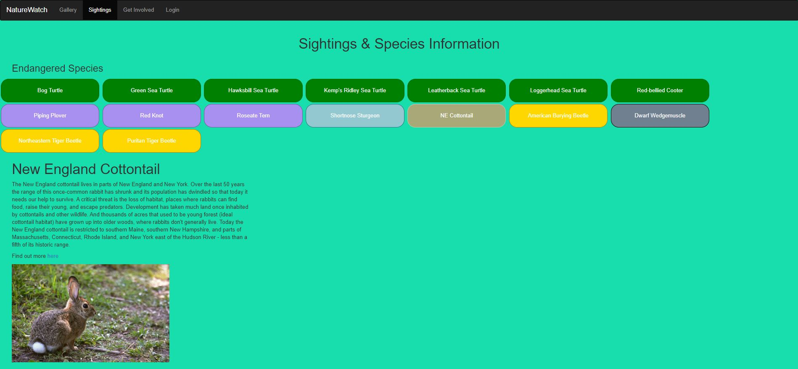

Team Omicron  
Application Name: Nature Watch  
Computer Science 326, Spring 2020  

Team Members:  
Jarrod Daniels - jcdaniels20,  
Jonathan Wu - JohnnyWu88,  
Michael Lai - impostercafe,

_______________________________________________________________________________________
_______________________________________________________________________________________

Application Overview:

Nature Watch is a web application that’s goal is to raise awareness of some of the most endangered species that have been known to be seen in and around the Massachusetts area. Our applications main feature is that it allows users to input sighting entries into a database to catalog times when they have seen one of these  endangered species. The goal of these sightings entries is to build a better understanding of where these animals are being seen in an effort to improve conservation efforts. On top of this, our application also allows users to upload photos related to their sighting database entries and provides resources for users to get involved with the local community and learn how to be more environmentally conscious. What makes this application innovative is it allows users to actively get involved with the protection of endangered species by being able to log their sightings which would in the future be able to be put to use for things such as habitat modeling and studies on animal abundancy in certain areas of the state 

______________________________________________________________
______________________________________________________________
User Interface:

index.html - This is the landing page of our website. Its purpose is to greet new users as well as introduce them to what our website is about as well as some of the prominant features. From here they can go to almost any other part of our website, either by clicking on the buttons on the page or simply using the navigation bar at the top. There is also a fun little slide show at the bottom of the page showcasing some of the endangered species showcased on the website.

gallery.html - this is one of the core pages of our website. Here is where users can view uploaded photos of endangered species. Its importance is to act as a way for users to share their sightings in a form of media other than just raw data.

sightings-home.html - This page is the home of one of our core features. On this page users are presented with a number of different buttons for endangered species. By clicking on one of the buttons, the user will be presented with a plethora of information on the given species as well as a link for more in depth info and a photo of the creature as well. Buttons are color coded based on the class of animal (reptiles green, birds blueish/purple, mammals tan, insects gold, fish blue, invertebrates grey). At the bottom of the page is a space where users can view their own sightings as well. They must simply input their username as well as the identifier they gave to the sighting when they created it. At the bottom of the page is a button that will take users to the create sighting page which we will cover next.

sightings.html - This is the page where users can create, update, and delete a sighting log from the database as well as upload images. The process is quite simple. the user simply fills out the data fields seen in the image below an can create a a sighting. Although we did not get to proper user authentication, the user also enters their account name and name of the sighting so that it is easier to keep track of for CRUD operations.

getInvolved.html - This page covers the last of the core features on our website. This web page acts a source of information for those who are interested in getting involved with local conservation efforts in Massachusetts or just learning about good practices and what is going on around the world in terms of conservation biology.

login.html - While we were not able to fully implement user authentication, we created the login page to handle this in case we ever did reach that point. On this page, users would be able to login into their existing account or create a new one as well by entering their email and username/password information.

lostpass.html - Going off of the last page, losstpass would have been a page where users would have been able to retrieve their account information/reset their password. While this was not used for the final submission of the product, in future versions this would be useful to have.

_____________________________________________________________________________
_____________________________________________________________________________

API's:

New Sighting API  
Overview  
The new sighting endpoint for our website provides a way for the clients to create a new sighting log for a critically endangered species in Massachusetts that will be input into our database

Endpoint URI and Parameters  
Assuming you are deploying the server on our heroku the URI for the new sighting endpoint will look like this: https://agile-woodland-51212.herokuapp.com/nature/create
 
For this endpoint, there are 10 required parameters and zero optional parameters (however for some of the questions the user has the option of answering ‘NA’)

Parameters  
Username: the username of the account creating the sighting  
SightingName: the name of the of the sighting (used as unique identifier)  
Species: the name of the species  
Date: The date of the sighting in mm/dd/yyyy format  
Time of day: The approximate time of the sighting in military time  
Location: The town in Massachusetts that the sighting was seen in  
Lat: The GPS latitude of the sighting  
Long: The GPS longitude of the sighting  
Approximate size: approximate size of the sighted animal in ounces  
Amount seen:  how many of the species were seen in the sighting

Responses  
The API returns all of the response data as JSON objects and inputs them into the database (for the purpose of this milestone we will be returned as JSON object like the in class assignments)

Result – string – operation status “successful” or “error”  
JSON Object – containing all of the above parameters entered
_________________________________________________________________________
Edit Sighting API  
Overview  
The edit sighting endpoint for our website provides a way for the clients to edit any sightings that they may have uploaded on the website (in case they made a mistake inputting information!)

Endpoint URI and Parameters  
Assuming you are deploying the server on our heroku server the URI for the edit sighting endpoint will look like: https://agile-woodland-51212.herokuapp.com/nature/edit
 
For this endpoint, the parameters will be the same as the previous API endpoint (create sightings)

Parameters:  
Username: the username of the account creating the sighting  
SightingName: the name of the of the sighting (used as unique identifier)  
Species name: the name of the species the sighting is about  
Date: The date of the sighting in mm/dd/yyyy format  
Time of day: The approximate time of the sighting in military time  
Location: The town in Massachusetts that the sighting was seen in  
Lat: The GPS latitude of the sighting  
Long: The GPS longitude of the sighting  
Approximate size: approximate size of the sighted animal in ounces  
Amount seen:  how many of the species were seen in the sighting  

Responses
The API returns all of the response data as JSON objects and updates them in the database (for the purpose of this milestone we simply return the updated json object much like the update function from the inclass exercise

Result – string – operation status “successful update” or “error”  
JSON Object – containing all of the above parameters entered
_________________________________________________________________________
View Sighting API  
Overview  
The view sighting endpoint for our website provides a way for the clients to look at their sightings for a given species that are stored in the database

Endpoint URI and Parameters  
Assuming you are deploying the server on our heroku server the URI for the view sighting endpoint is: https://agile-woodland-51212.herokuapp.com/nature/view
 
For this endpoint, there will be two required parameters  
Parameters:  
username : the account username  
sighting name: the unique identifier for the sighting as defined in create

Responses
Result – string – "Viewing sighting info for 'sighting name'"  
returns all of the infromation for that given sighting
_________________________________________________________________________
Delete Sighting API  
Overview  
The view sighting endpoint for our website provides a way for the clients to delete their sightings that are stored in the database

Endpoint URI and Parameters  
Assuming you are deploying the server on our heroku server the URI for the view sighting endpoint is: https://agile-woodland-51212.herokuapp.com/nature/delete
 
For this endpoint, there will be two required parameter  
Parameters:  
username : the account username  
sighting name: the unique identifier for the sighting as defined in create

Responses  
Result – string – "Sighting deleted'

____________________________________________________________________________________
Upload Image API  
Overview  
The upload image endpoint for our website provides a way for users to upload new images into our database that will eventually be displayed in the gallery tab

Endpoint URI and Parameters  
Assuming you are deploying the server on … the URI for the upload image endpoint is:
 
For this endpoint, there will be 3 required parameters.  
Parameters:  
Photo Title:  the unique title given to a photo  
Species  name: name of species sighting is of  
File : the file containing the image itself  

Responses:  
Result – string – operation status “successful upload ” or “error”  
Image – img file  
_________________________________________________________________________
Create Login API  
Overview  
This API allows users to create new accounts on the website so that they may create new database entries and upload images

Endpoint URI and Parameters  

Assuming you are deploying the server on heroku the URI for the create login endpoint is:
https://agile-woodland-51212.herokuapp.com/nature/newLogin
 
For this endpoint, there will be three required parameters.  
Parameters  
Email – email address  
username – account name  
password – account password  

Responses  
Result – string – operation status “successful account creation with (entered username X) and passowor (entered password)” or “error”
_________________________________________________
_________________________________________________

Database Relations :

Our databasing has not changed since the previous milestone and as a result it remains unchanged.

Sighting Documentation  
{  
    id: ObjectId,  
    Sighting name:  String, // the unique name given to a sighting  
    Species  name: String, // name of species sighting is of  
    Date : Date-time, // the date of the sighting (12/31/1998)  
    Time : Date-time, // the time of the sighting (14:00)  
    Location : String, // the town the sighting was in  
    Latitude : Number, //  the latitude coordinates of the sighting  
    Longitude : Number, // the longitude coordinates of the sighting  
    Size : Number, // Approximate size of species in Oz  
    Amount Seen : Number, Amount of same species seen in proximity  
}  

Login Documentation  
{  
    id: ObjectID,  
    username: String    // account username  
    password: String    // account password  
    email: String       // account email  
} 

Photo Documentation  
{  
    id: ObjectId,  
    Photo Title:  String, // the unique title given to a photo  
    Species  name: String, // name of species sighting is of  
    File : file, //  the file containing the image itself  
}  

_________________________________________________________________________________
_________________________________________________________________________________

URL Routes/Mapping:

url: "https://agile-woodland-51212.herokuapp.com/nature";  
The url for our website on heroku (it is also used for url variable below when creating paths)

sightingCreate: url + "/users/" + userName + "/create";  
 This is used for the create function on the sightings page

viewSighting: url + "/users/" + userName + "/view";  
This is used for the view function on the sightings-home page

sightingEdit: url + "/users/" + userName + "/edit";  
 This is used for the update function on the sightings page

sightingDelete: url + "/users/" + userName + "/delete";  
 This is used for the delete function on the sightings page

newUserHandler:  url + "/users/" + userName + "/createLogin";  
 This is used for the create login on the login page

__________________________________________________________________________________
__________________________________________________________________________________

Authentication/Authorization: 

Sadly we were not able to get to user authentication for this project. At the current moment, we have it setup so that a username is used when creating a sighting log along with a unique name for each sighting. While this is a form of user authentication, there is an inherent problem that anyone who knows a given username and sighting name will have full CRUD operations for that sighting... luckily for the purpose of the project the people most likely to use the app would hopefully not abuse this.

__________________________________________________________________________________
__________________________________________________________________________________

Division of Labor For Website:  
(for this final write up, team omicron worked on the write up in a google doc so each member could more easily write about their portions of the project and collaborate together. As a result, we are having one person push the write up, but each person worked on their respective parts of the paper that related to what they worked on in the actual project.)

________________________________

Jarrod Daniels:

Milestone 1:   Wireframes, Navigation bars, Home Page, Gallery page, sightings-home.html page (HTML & CSS for all pages listed)

Milestone 2:   Static javascript on the sightings-home.html page and gallery page, server routing setup, Create, View, & Edit Sightings routing, heroku deployment 

Milestone 3:   Database and back end setup/configuration, Create Sighting & View Sighting database interactions. Edit sightings (using GET)

(note, my insertions / deletions on the github repository look abnormally high because I pushed the node modules files to github and had to remove them. If you take the difference of my insertions/deletions it will yield a more accurate number)
________________________________________________________________

Johnny Wu:

Milestone 1:   Sightings entry page, Log in page (HTML & CSS for pages listed)

Milestone 2:   Uploading image javascript/routing

Milestone 3:   Edit photos & edit sighting (moving from GET -> POST) database interactions

________________________________________________________________

Michael Lai

Milestone 1:   Get involved page, Lost Password page, Helped with tweaking navigation bars. (HTML & CSS for pages listed)

Milestone 2:   New user login (javascript/routing), Existing user login javascript, lost password javascript.

Milestone 3:   New user login and delete sightings database interactions

__________________________________________________________________________________
__________________________________________________________________________________

Conclusion:

Though the transition to an online group project has been difficult, I believe we learned a valuable lesson about working as a team while being remote (as this seems to be where the future is heading). Through this class and final project, we have learned several important web programming skills that are needed to create a function web app. We have learned how to properly create and manipulate HTML and CSS to create stylized, interactive, and user-friendly web pages. We also learned how to code in javascript in order to create a functioning client side and back end portion of a web page. To add onto this, we also learned about routing  and how to link our javascript functions together so that they would properly run on a server. Finally, we learned how to tie everything together by deploying our website on Heroku as well as setting up a database connection on our server so that we could perform CRUD operations on data. This project did have its difficulties, however. Coming into this project, all of us were novices in terms of our skill in web programming. Through endurance and hard work however we were able to create a web page that had some of the core functionalities that we had originally planned. One major part of this project for us was adapting our web page to fit needs that we could and could not meet. When we began this project, we were very ambitious and wanted many features that we did not necessarily have the knowledge or resources to implement. If we were to continue this project in the future, there would definitely be  more fine tuning done on the website, as well as implementing some of the features we had in our original concept (such as a geo location map). On a final note, team omicron wanted to extend a big thanks to professor Berger as well as Ishan and William who have been a big help with completing our project as well as making a good transition to remote learning during these uncertain times.
