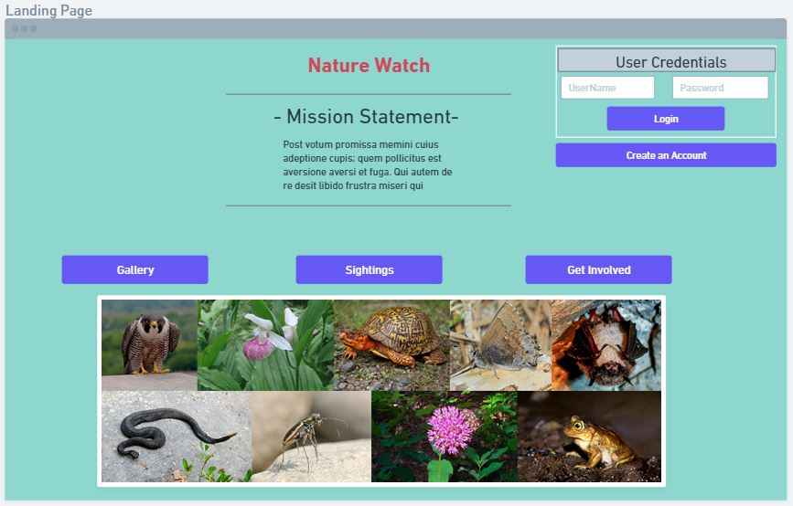
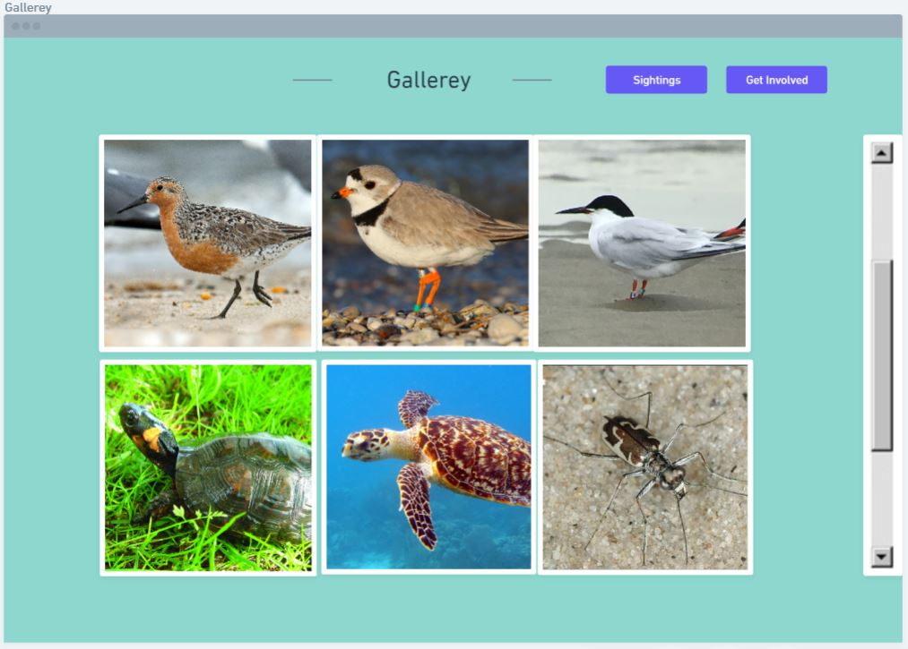

CS326 Group Omicron Milestone 1

PART 0: Data Interactions

For the data interactions portion of this porject, it will remain the same as earlier specified in milestone 0.

As mentioned before the user will have a variety of data interactions with the website

-The user will first be able to login and have an account, this will allow them to make posts and upload the information that is specified below

-The users will be able to upload images of endangered species that they have seen and it will be put into an archive that can be viewed by users and non users. (We want to also allow people to comment on image uploads much like instagram however this will be more fleshed as we design the website capabilities)

- The user will also be able to post geo-location data as well as being able to upload sighting information into a database.

-Users be able to input data about species such as their gender, color, the location they saw them in and the time of day it was spotted

-Users will also be able to edit their own sightings but not others

-Database entries/Photos should be viewable by all users regardless of whether or not they have an account
__________________________________________________________________________________________________________

PART 1: Wireframes

When the user first visits our website, they will be taken to the landing page seen below

From this page, the user has a variety of options that they can choose from. These options include being taken to either the gallerey, sightings, or get involved page (each of which have their own unique set of content for users). The user also has the ability to log into their account from this home page. If the user does not have an account, they will also be able to make one as well.

To begin the user can travel to any parts of the website by clicking on the buttons in the mid section of the screen above. To start we can begin by clicking the Gallerey page which will take us to this...

