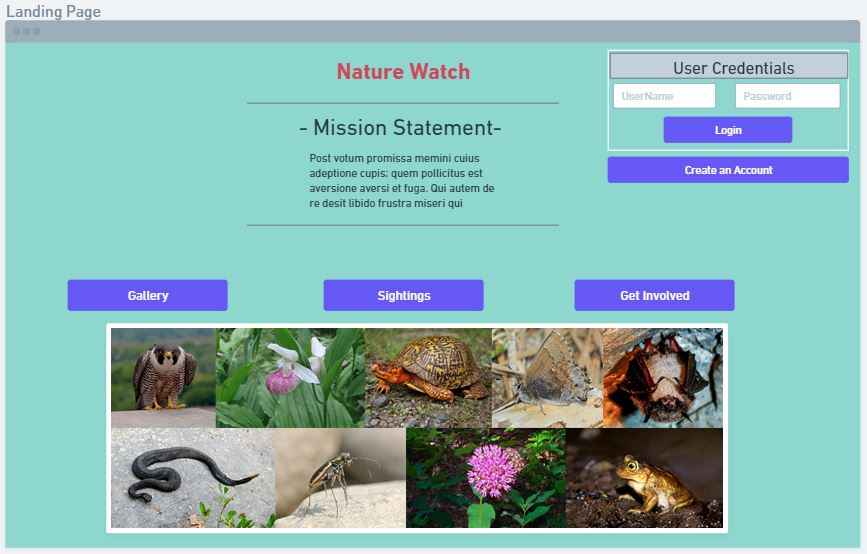
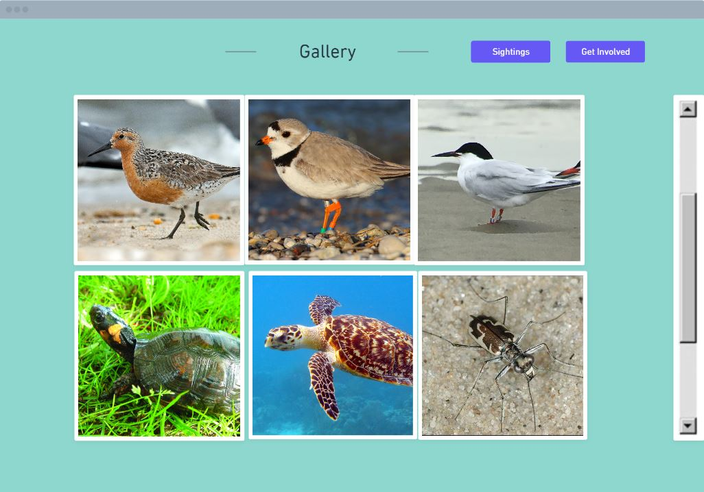
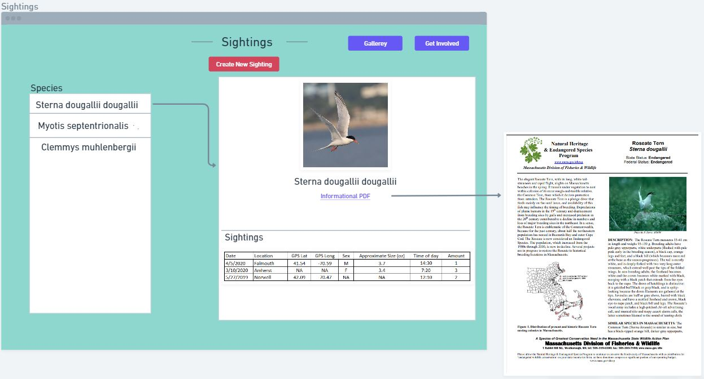
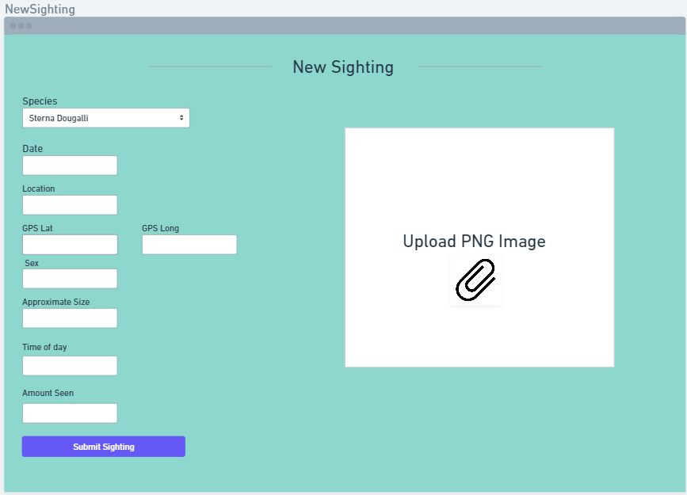
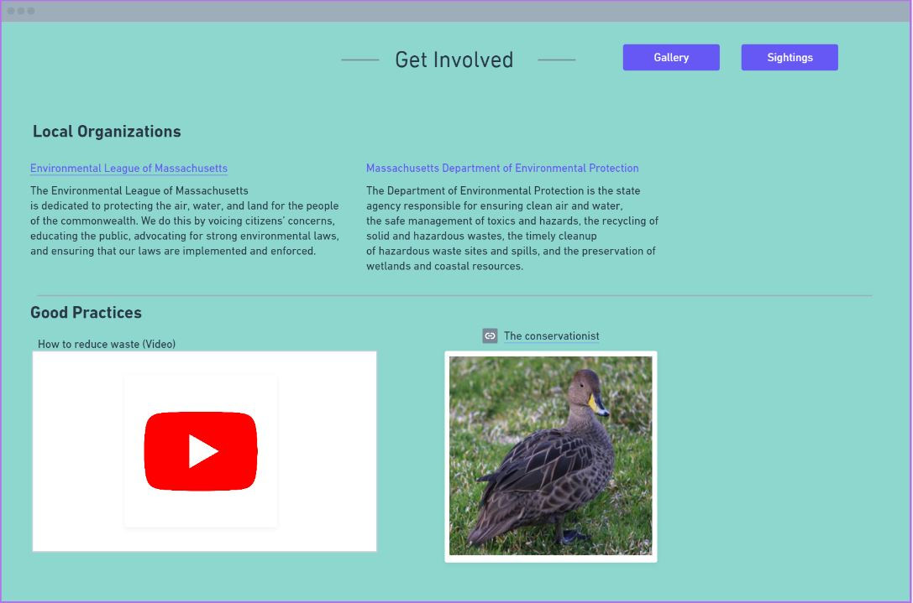
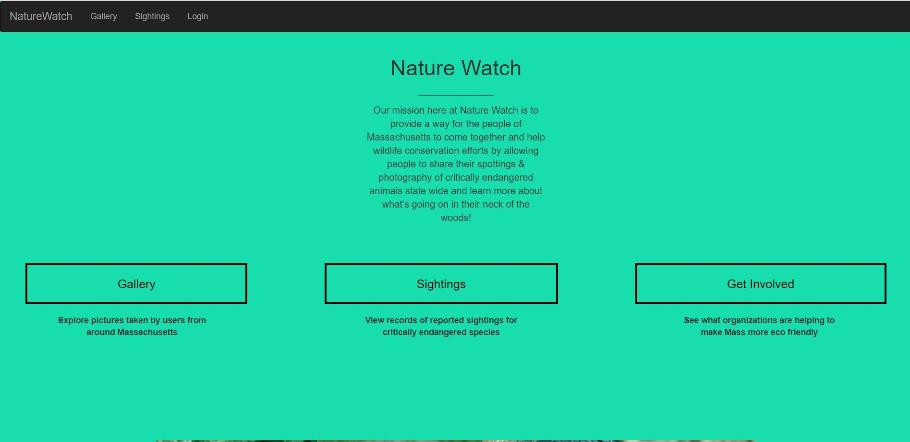
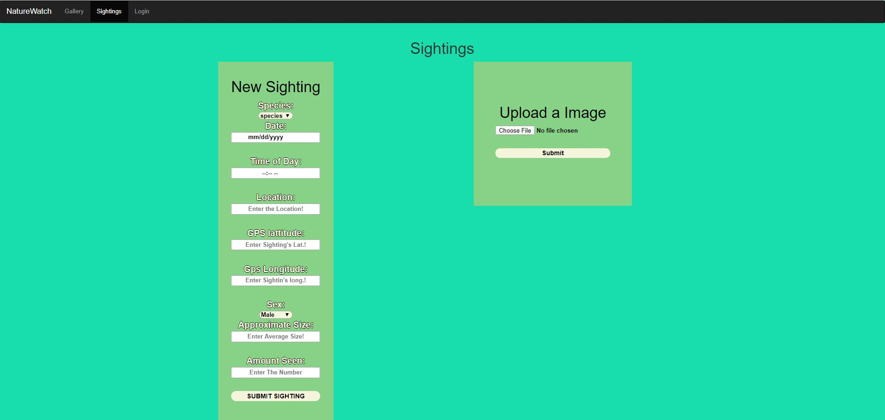
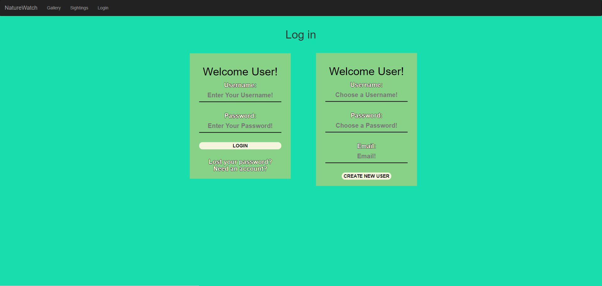
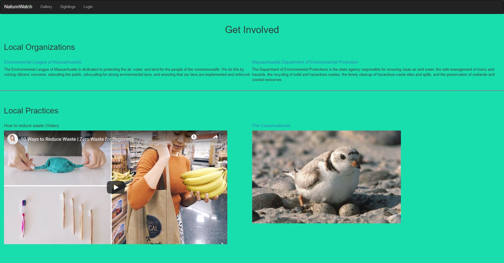

CS326 Group Omicron Milestone 1

PART 0: Data Interactions

For the data interactions portion of this porject, it will remain the same as earlier specified in milestone 0.

As mentioned before the user will have a variety of data interactions with the website

-The user will first be able to login and have an account, this will allow them to make posts and upload the information that is specified below

-The users will be able to upload images of endangered species that they have seen and it will be put into an archive that can be viewed by users and non users. (We want to also allow people to comment on image uploads much like instagram however this will be more fleshed as we design the website capabilities)

- The user will also be able to post geo-location data as well as being able to upload sighting information into a database.

-Users be able to input data about species such as their gender, color, the location they saw them in and the time of day it was spotted

-Users will also be able to edit their own sightings but not others

-Database entries/Photos should be viewable by all users regardless of whether or not they have an account
__________________________________________________________________________________________________________

PART 1: Wireframes

When the user first visits our website, they will be taken to the landing page seen below

From this page, the user has a variety of options that they can choose from. These options include being taken to either the gallerey, sightings, or get involved page (each of which have their own unique set of content for users). The user also has the ability to log into their account from this home page. If the user does not have an account, they will also be able to make one as well.

To begin the user can travel to any parts of the website by clicking on the buttons in the mid section of the screen above. To start we can begin by clicking the Gallerey page which will take us to this...

Users can browse through photos taken and uploaded by other users. clicking on an image will bring up the full photo as well as the name of the species that the photo is of. 

From there we can look at the next page, which is the sightings page. The layout for it is seen in the two images below...

On this page, users will have two options. They will either be able to view sightings or create their own (they must be logged in to create a view. If they are not logged in they will be taken to a log in page). This page will consist of a list of protected/endangered species in Massachusetts and by clicking on the species name they will be able to see the animal's picture as well as the sightings for it. There will also be a link to a pdf that gives more information on the species that is publicy aviablable on the mass gov website.

When the user goes to input a new sighting, the website will ask for a variety of infromation including things like species name, location and time of day. Based upon the species name, the information will then be added to the appropriate data table. The image upload will also be also then be added to the gallerey.

The third part of the website is the get involved section of the website and is seen in the wireframe image below...

This page will act as a source of information for users who want to get more involved in the Mass community. It will be chalked full of links to conservation related organizations in Mass. There will also be pinned videos as well as articles and links to websites with articles for people who are interested in learning more about being eco friendly and conservation efforts around the world. 

______________________________________________
Part 2 : HMTL & CSS 

When developing the HTML for the website, we made some slight changes to the wireframe pre-designs to make it more thorough and add some important features. Below are the images for all of the pages on our website!

Home Page

(There is a slideshow beneath the buttons which is on an automatic carousel)

(The gallery page currently has an empty grid of images. We are currently working on how to live time update it via uploaded images by users)

________________________________________________

Division of labor

Jarrod Daniels - Created Wireframes, Base pages for Main features, Navigation bars, Home Page, Gallery page

Johnny Wu - Sightings page, Log in page, touching up css

Michael Lai - Get involved page, Css styling, Helped with tweaking navigation bars. 