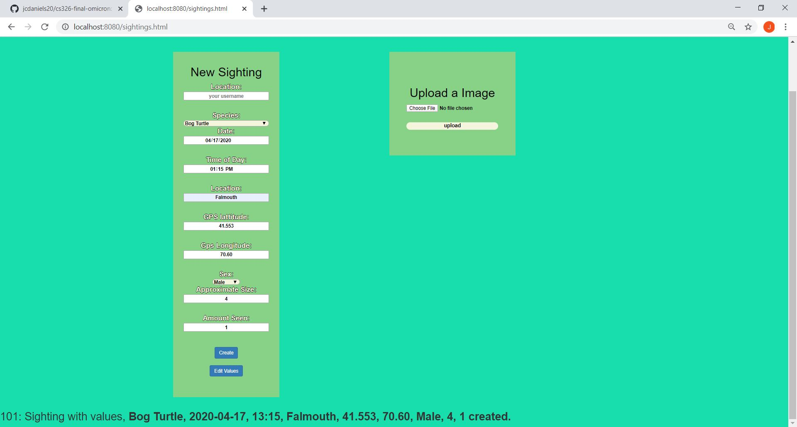
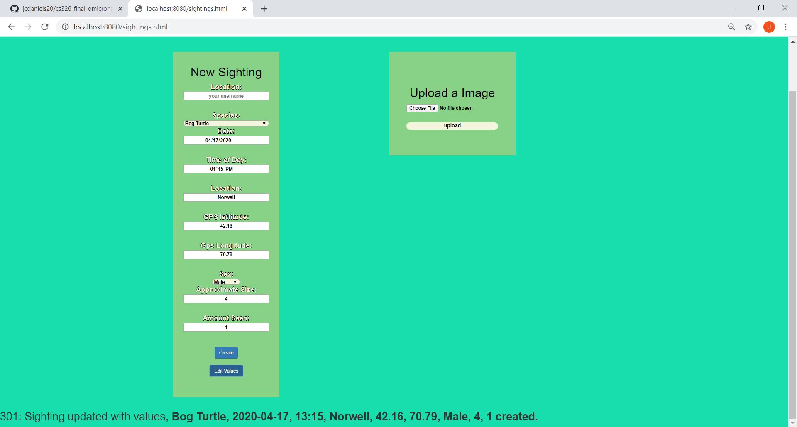
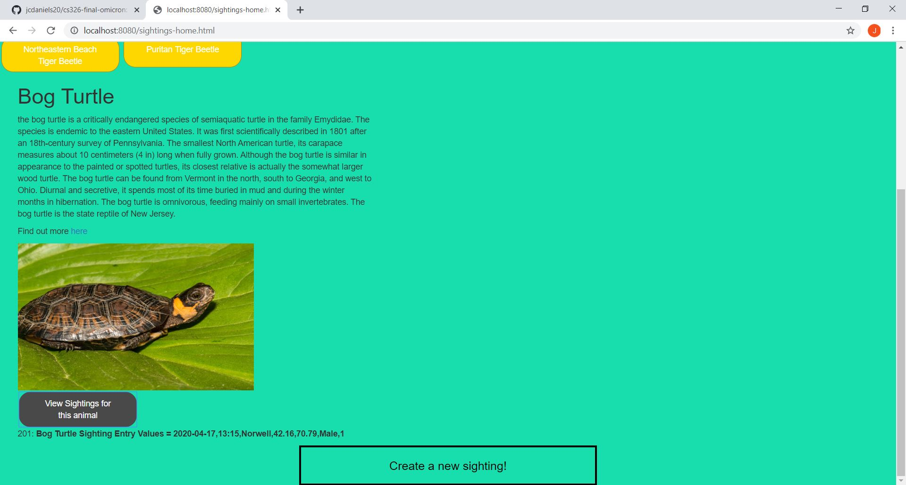
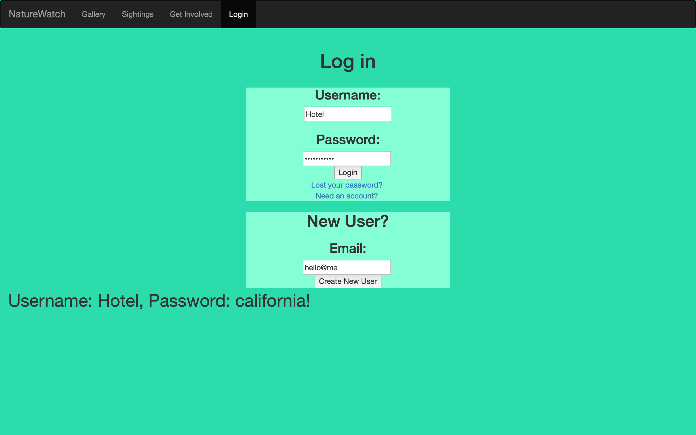
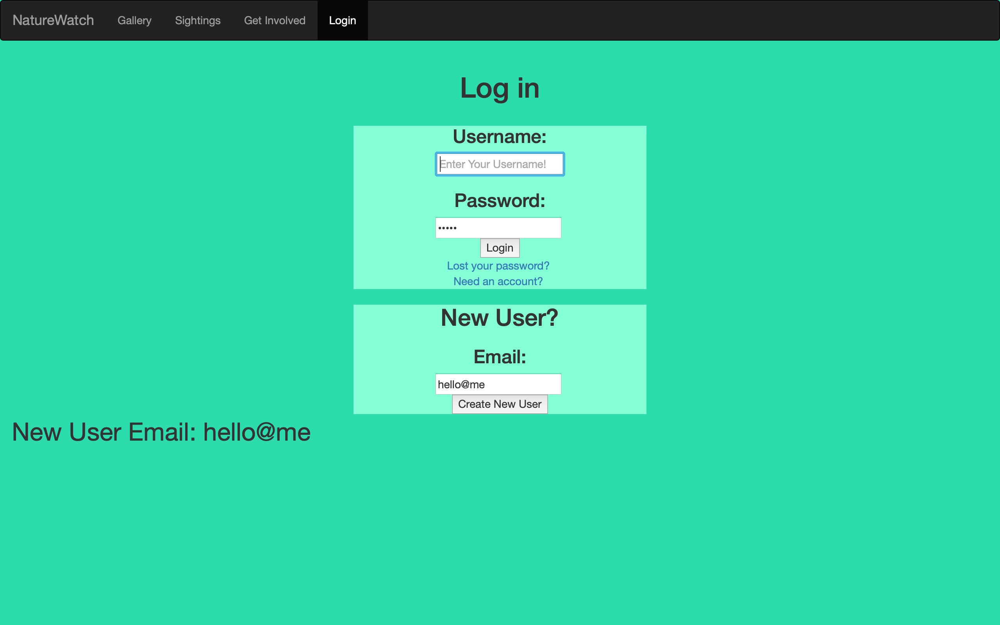

CS 326 – Team Omicron
Part 0: Project API Planning
All Endpoints
_________________________________________________________________________
New Sighting API
Overview
The new sighting endpoint for our website provides a way for the clients to create a new sighting log for a critically endangered species in Massachusetts that will be input into our database

Endpoint URI and Parameters
Assuming you are deploying the server on our heroku … the URI for the new sighting endpoint will look like this: https://agile-woodland-51212.herokuapp.com/nature/create
 
For this endpoint, there are eight required parameters and zero optional parameters (however for some of the questions the user has the option of answering ‘NA’)

Parameters
Species: the name of the species
Date: The date of the sighting in mm/dd/yyyy format
Time of day: The approximate time of the sighting in military time
Location: The town in Massachusetts that the sighting was seen in
Lat: The GPS latitude of the sighting
Long: The GPS longitude of the sighting
Approximate size: approximate size of the sighted animal in ounces
Amount seen:  how many of the species were seen in the sighting

Responses
The API returns all of the response data as JSON objects and inputs them into the database (for the purpose of this milestone we will be returned as JSON object like the in class assignments)

Result – string – operation status “successful” or “error”
JSON Object – containing all of the above parameters entered

Important Note: in the future, we are hoping to implement some form of unique ID that gets tied to each entry to make it easier to edit
_________________________________________________________________________
Edit Sighting API
Overview
The edit sighting endpoint for our website provides a way for the clients to edit any sightings that they may have uploaded on the website (in case they made a mistake inputting information!)

Endpoint URI and Parameters
Assuming you are deploying the server on our herokue server the URI for the edit sighting endpoint will look like: https://agile-woodland-51212.herokuapp.com/nature/edit
 
For this endpoint, the parameters will be the same as the previous API endpoint (create sightings)

Parameters:
Species name: the name of the species the sighting is about
Date: The date of the sighting in mm/dd/yyyy format
Time of day: The approximate time of the sighting in military time
Location: The town in Massachusetts that the sighting was seen in
Lat: The GPS latitude of the sighting
Long: The GPS longitude of the sighting
Approximate size: approximate size of the sighted animal in ounces
Amount seen:  how many of the species were seen in the sighting

Responses
The API returns all of the response data as JSON objects and updates them in the database (for the purpose of this milestone we simply return the updated json object much like the update function from the inclass exercise

Result – string – operation status “successful update” or “error”
JSON Object – containing all of the above parameters entered
_________________________________________________________________________
View Sighting API
Overview
The view sighting endpoint for our website provides a way for the clients to look at the sightings for a given species that are stored in the database

Endpoint URI and Parameters
Assuming you are deploying the server on our heroku server the URI for the view sighting endpoint is: https://agile-woodland-51212.herokuapp.com/nature/view
 
For this endpoint, there will be one required parameter but it will automatically be put in by the computer by clicking on the "view sightings" button for a given species

Parameter:
Species name : the name of the species and the identifier for the database entry

Responses
Result – string – "Viewing sightings for 'Insert species name here' ...
_________________________________________________________________________
Upload Image API
Overview
The upload image endpoint for our website provides a way for users to upload new images into our database that will eventually be displayed in the gallery tab

Endpoint URI and Parameters
Assuming you are deploying the server on … the URI for the upload image endpoint is:
 
For this endpoint, there will be one required parameter.
Parameters: 
Image file – the actual image of the species taken
Responses
Result – string – operation status “successful deletion” or “error”
Image – img file
_________________________________________________________________________

Create Login API
Overview
This API allows users to create new accounts on the website so that they may create new database entries and upload images

Endpoint URI and Parameters
Assuming you are deploying the server on heroku the URI for the create login endpoint is:
https://agile-woodland-51212.herokuapp.com/nature/newLogin
 
For this endpoint, there will be three required parameters.
Parameters 
Email – email address
username – account name 
password – account password

Responses (for this milestone)

Result – string – operation status “successful account creation with (entered username X) and passowor (entered password)” or “error”
_________________________________________________________________________

Overview
This API allows users to login into their pre-existing accounts, If they do not have one they will have to use to above login to create one

Endpoint URI and Parameters
Assuming you are deploying the server on heroku the URI for the login endpoint is:
https://agile-woodland-51212.herokuapp.com/nature/newLogin
 
For this endpoint, there will be two required parameters.
Parameters 
Username – account username 
Password – account password
Responses (for this milestone)

Result – string – operation status “successful login” or “error”
JSON Object with name of account and the password, both strings

_________________________________________________________________________

Screen shots and descriptions -

Creating a new sighting 

As described in the API layout above, this is where users can enter new sightings into the database for a given species. After filling out this information and pressing the 'Create' Button the new sighting will be generated and sent to the mongo db. The resulting value are then output at the bottom of the page to show that is has succesfully been created.

Editing a sighting

Here, very similar to the previous funciton the update function allows users to update existing entries into the database. As seen in the image when the user presses update on the bog turtle sighting, the DB replaces the previous entries with the new information. This info is then sent to the DB and the resulting values are displayed below. The key difference right now is that edit utalizes "upsert : false" in the database so if the user's entry does not exists, it will not create a sighting.

Viewing the sightings

On the main sightings page is where users can actually view the sighting info that was stored in the mongo database. The user can click around the static buttons to see all the information on the endangered species but they can also click "view sightings for this animal" which executes a get from the database and pulls values with that species name as its key. For this example we can see that it correctly displayed the bog turtle information that we updated in the previous photo.

Creating a new login

Here users can create new logins by entering the infromation in the login field along with their email

Existing user login

Here users with prexisting login information can login to their accounts

________________________________________________________
Heroku URL

https://agile-woodland-51212.herokuapp.com/

________________________________________________________
Division of labor

Jarrod Daniels - write up, creating sightings, editing sightings, viewing sightings, all static content on the sightings-home.html page and gallery page, server routing and heroku deployment.

Michael Lai - New user login, Existing user login, lost password 

Johnny Wu - Uploading image

